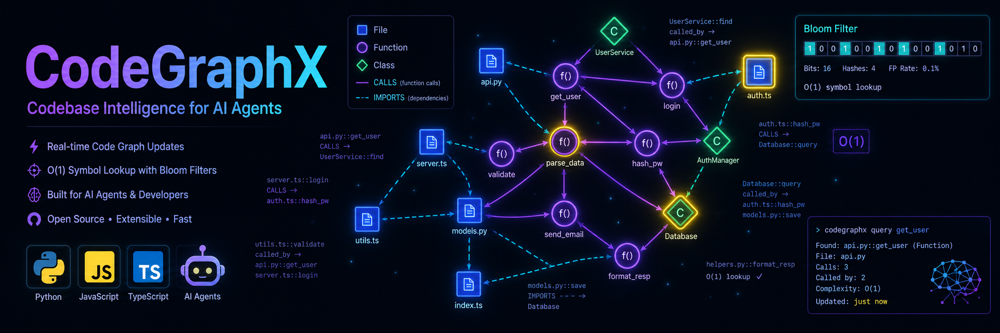

<h1 align="center">CodeGraphX</h1>

---

<p align="center">
  
</p>

<!-- # CodeGraphX\ -->

A local, token-efficient, dynamic codebase graph system designed specifically for AI coding agents (like Gemini CLI, Claude Code, Cursor) and human developers.

Its core purpose is to solve the problem of AI agents having to constantly re-scan files to understand a codebase. Instead, CodeGraphX uses **Tree-sitter** to incrementally parse code (Python, JS, TS, HTML, CSS) and builds a virtual dependency graph. It outputs highly compressed files in the **TOON (Token-Oriented Object Notation)** format and a **Bloom filter** for instant O(1) symbol lookup.

This project is built purely in Node.js. No Python environment is required to use it, even though it can parse Python code!

## Installation

Install CodeGraphX globally via npm so you can use the CLI anywhere, or install it as a development dependency in your project.

```bash
npm install -g codegraphx
```

## Standalone Usage (CLI)

CodeGraphX can be used as a standalone tool to visualize and query your codebase's structure.

### Simple Example

Navigate to your project directory and initialize the graph:

```bash
cd my-project
codegraphx init
```
This will parse your codebase and generate the initial graph inside the `.codegraphx/` directory.

You can then query the graph. For example, to find out what depends on a function named `calculateTotal`:

```bash
codegraphx query calculateTotal
# Or, trace its entire downstream impact:
codegraphx impact calculateTotal --direction downstream
```

To see a live, real-time visualization of your codebase in your browser:

```bash
codegraphx watch
codegraphx dashboard
```

### Key Commands
- `codegraphx init` / `codegraphx scan`: Parses the codebase and generates the graph (`.codegraphx.db` + `.codegraphx/` artifacts).
- `codegraphx watch`: Starts the file watcher for real-time live graph updates.
- `codegraphx query <symbol>`: Show details (files, edges, calls, called_by) for a specific symbol.
- `codegraphx impact <symbol>`: Trace all symbols directly or indirectly impacted by a given symbol.
- `codegraphx doctor`: Diagnose the codebase — parse errors, unresolved imports/calls, circular dependencies.
- `codegraphx dashboard`: Opens a live interactive HTML graph visualization in your default browser.
- `codegraphx stats`: Prints graph statistics (files, symbols, edges).

## Usage with AI Coding Agents (MCP Server)

CodeGraphX includes an **MCP (Model Context Protocol) Server**. This is where it truly shines. Instead of the AI agent blindly reading raw source files, it can use the `cgx-mcp` server to intelligently query your codebase structure, saving thousands of tokens and eliminating "cold start" scanning time.

**Zero-setup:** you do not need to run a scan first. On its first start in a project, the server automatically indexes the codebase in the background. While indexing, `get_graph_status` reports `"indexing"`; once it reports `"ready"`, every tool is live.

### MCP Tools

| Tool | What it does |
|---|---|
| `get_graph_status` | Health/readiness check: `indexing`, `ready`, or `error`, plus file count. |
| `list_files` | List indexed files, with an optional substring `filter`. |
| `check_symbol_exists` | Instant O(1) Bloom-filter lookup — returns `probable_yes` or `definite_no`. |
| `explain_impact` | Blast radius of a symbol: who uses it upstream, what it breaks downstream. |
| `verify_task` | Compare a task description against a commit's actual changes — returns status, changed symbols, and untested additions. |
| `get_session_diff` | Structural summary of changes vs HEAD or a branch. |

### Picking the project root

The server indexes the directory it is started in. If your MCP client doesn't set a working directory, pass it explicitly — either way works:

```bash
cgx-mcp --project-root /path/to/your/project
# or
CGX_PROJECT_ROOT=/path/to/your/project cgx-mcp
```

### Claude Code Configuration

From inside your project directory:

```bash
claude mcp add codegraphx -- npx -y -p codegraphx cgx-mcp
```

Or in your project's `.mcp.json`:

```json
{
  "mcpServers": {
    "codegraphx": {
      "command": "npx",
      "args": ["-y", "-p", "codegraphx", "cgx-mcp"]
    }
  }
}
```

### Claude Desktop Configuration

Add to `claude_desktop_config.json` (on macOS: `~/Library/Application Support/Claude/claude_desktop_config.json`). Claude Desktop has no project directory, so set the root explicitly:

```json
{
  "mcpServers": {
    "codegraphx": {
      "command": "npx",
      "args": ["-y", "-p", "codegraphx", "cgx-mcp", "--project-root", "/path/to/your/project"]
    }
  }
}
```

### Gemini CLI Configuration

In your project's `.gemini/settings.json` (use an absolute path to `node` — Gemini doesn't inherit your shell PATH; see `mcp-setup.md` for troubleshooting):

```json
{
  "mcpServers": {
    "codegraphx": {
      "command": "/ABSOLUTE/PATH/TO/node",
      "args": ["/ABSOLUTE/PATH/TO/node_modules/codegraphx/bin/cgx-mcp"],
      "cwd": "/ABSOLUTE/PATH/TO/YOUR_PROJECT"
    }
  }
}
```

Once configured, simply tell your agent: *"Use the CodeGraphX MCP server to find where the `authenticateUser` function is defined and what other functions call it."* The agent will instantly traverse the graph instead of using expensive file `grep` searches.